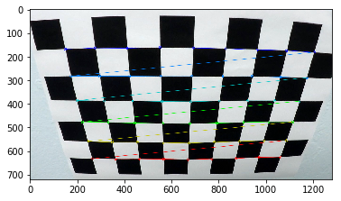

### Advanced Lane Finding Project

The goals / steps of this project are the following:

* Compute the camera calibration matrix and distortion coefficients given a set of chessboard images.
* Apply a distortion correction to raw images.
* Use color transforms, gradients, etc., to create a thresholded binary image.
* Apply a perspective transform to rectify binary image ("birds-eye view").
* Detect lane pixels and fit to find the lane boundary.
* Determine the curvature of the lane and vehicle position with respect to center.
* Warp the detected lane boundaries back onto the original image.
* Output visual display of the lane boundaries and numerical estimation of lane curvature and vehicle position.

[//]: # (Image References)

[image1]: ./examples/undistort_output.png "Undistorted"
[image2]: ./test_images/test1.jpg "Road Transformed"
[image3]: ./examples/binary_combo_example.jpg "Binary Example"
[image4]: ./examples/warped_straight_lines.jpg "Warp Example"
[image5]: ./examples/color_fit_lines.jpg "Fit Visual"
[image6]: ./examples/example_output.jpg "Output"
[video1]: ./project_video.mp4 "Video"

---
## [Rubric](https://review.udacity.com/#!/rubrics/571/view) Points

### Here I will consider the rubric points individually and describe how I addressed each point in my implementation.  

---

### Writeup / README

### Camera Calibration

#### 1. Briefly state how you computed the camera matrix and distortion coefficients. Provide an example of a distortion corrected calibration image.

The code for this step is contained in the second code cell of the IPython notebook located in `AdvanceLaneFinding.ipynb`

I start by preparing "object points", which will be the (x, y, z) coordinates of the chessboard corners in the real world. Here I am assuming the chessboard is fixed on the (x, y) plane at z=0 for simplicity, such that the object points are the same for each calibration image.  Thus, `objpts` is just a replicated array of coordinates, and `objpoints` will be appended with a copy of it every time I successfully detect all chessboard corners in a test image provided.  `imgpoints` will be appended with the (x, y) pixel position of each of the corners in the image plane with each successful chessboard detection.  

I then used the output `objpoints` and `imgpoints` to compute the camera calibration and distortion coefficients using the `cv2.calibrateCamera()` function. 





I applied this distortion correction to the test image using the `cv2.undistort()` function and obtained this result: 


---

### Pipeline

#### 1. Provide an example of a distortion-corrected image.

To demonstrate this step, I will describe how I apply the distortion correction to one of the test images like this one:


I've got the correction matrix and the distance from the center of the undistorted image using camera calibration previously. Then used the same to undistort all the frames in the video just as the above image. Distortion-correction seems to have reduced the unneccesary curvature of the image in the edges.

---

#### 2. Describe how (and identify where in your code) you used color transforms, gradients or other methods to create a thresholded binary image.  Provide an example of a binary image result.

I used a combination of color and gradient thresholds to generate a binary image (thresholding steps at code cells 3 and 4 in  `AdvanceLaneFinding.ipynb`). After applying various combinations of color and gradient thresholds I finally used the combination of H channel threshold and sobel x tranform to get the desired result.

Here are the following color and gradient threshold and combinations I tried to use and the corresponding results:

* #### Magnitude threshold 


As we could see this is slightly noisy, we are able to detect shadows along with the lane lines. The better results were obtained with the lower threshold 30 and 90 and the values below or above this either detects too many features or not detects any usable features.


* #### Direction threshold

Direction threshold between threshold 0.7 and 1.3 with the kernel size seems to detect the lane lines better with tolerable noise. This could be combined with other channels to remove the noise.


* #### Magnitue and Direction Combination

Then I combined the magnitude and direction thresholds to get the below result. Using this combination doesn't seem to detect all the lane lines across the entire video.


* #### S Channel threshold

Next I used the S channel of the HLS representation. I thresholded the pixel values between 200 and 255 and the result was as below and seemed the optimal range. The other range thresholds were either too noisy or didn't detect lane line at all.


* #### R Channel threshold

Next I used the R channel of the RGB representation. I thresholded the pixel values between 170 and 255 and the result was as below and seemed the optimal range. The other range thresholds were either too noisy or didn't detect lane line at all.


* #### Magnitude, Direction and S channel Combination

Then I tried to combine the magnitue, direction and s channel thresholds. This combination seemed to work well except for the shaded region.


* #### Magnitue, Direction and R channel Combination

This combination seems to be too noisy to detect lane lines.


* #### Magnitue, Direction, S Channel and R Channel Combination

Then I combined the R and S channels with the magnitude and direction channels. Again this combination was too noisy.


* #### Sobel X and S Channel Combination

As the magnitude and direction combination along with other color thresholds didn't work, I switced to sobel x and S channel combination. This proved to the so far best solution except the noise in the shaded region.


* #### H Channel 

As we know the H channel doesn't respond to color strength, I chose to threshold the H channel in the range 20 and 100 which was the optimal range to detect lane lines. But this was not sufficient to detect all the lane lines across the video.


* #### Sobel X and H Channel

Finally I combined the X and S channel to get the desired output with lanes and without noise.


---


#### 3. Describe how (and identify where in your code) you performed a perspective transform and provide an example of a transformed image.

The code for my perspective transform includes a function called `Wrap()`, which appears in code cell 6 in my  `AdvancedLaneFinding.ipynb` .  The `Wrap()` function takes as inputs an image (`img`).  I chose the hardcode the source and destination points in the following manner:

```python
src = np.float32(
    [[(img_size[0] / 2) - 55, img_size[1] / 2 + 100],
    [((img_size[0] / 6) - 10), img_size[1]],
    [(img_size[0] * 5 / 6) + 60, img_size[1]],
    [(img_size[0] / 2 + 55), img_size[1] / 2 + 100]])
dst = np.float32(
    [[(img_size[0] / 4), 0],
    [(img_size[0] / 4), img_size[1]],
    [(img_size[0] * 3 / 4), img_size[1]],
    [(img_size[0] * 3 / 4), 0]])
```

This resulted in the following source and destination points:

| Source        | Destination   | 
|:-------------:|:-------------:| 
| 585, 460      | 320, 0        | 
| 203, 720      | 320, 720      |
| 1127, 720     | 960, 720      |
| 695, 460      | 960, 0        |

I verified that my perspective transform was working as expected by drawing the `src` and `dst` points onto a test image and its warped counterpart to verify that the lines appear parallel or respresent the exact turn in the warped image.


---

#### 4. Describe how (and identify where in your code) you identified lane-line pixels and fit their positions with a polynomial?

The code to identify the lane-line pixels is present in the 8th code cell of the `AdvancedLaneFinding.ipynb` inside the method called SlidingWindow. I've used the sliding window logic given in the course material. The idea behind this logic is actually to find the pixels which have the maximum intensity in the lower half of the image ( as lane lines are present only in this region). We divide the lower half of the images in to n regions of desired value n. Here I've used 9 as n value. Then identify the two lanes by using histogram to find the actual starting point of the lane lines from the bottom. Histogram gives 2 peaks as we have filtered out all other pixels from this region. Then taking this as the base points, we further divide the region into left and right sides. Then use windows iteratively to gather pixels from the n regions we have identified in the step1. The sliding window searches for the pixels count greater than a given threshold (50 in my case). If no such number of pixels are identified then it takes the previous window values as the pixel count of this value. Once we have identified the pixels, we get the x and y values for the left and right side respectively. Then finally use the gathered points to create a 2nd order equation to fit the identified points and plot it as below. 


---

#### 5. Describe how (and identify where in your code) you calculated the radius of curvature of the lane and the position of the vehicle with respect to center.

In the code cell 7 of  my `AdvancedLaneFinding.ipynb` I've created a method called RadiusOfCurvature which takes all the identifed x and y coordinates for both left and right lanes. It then computes a second order polynomial to fit the identified points. Then applies the radius of curvature formula to the find the actual radius of curvature and converts from pixels to meter value as suggested. Then computed the mean of left and right curvatures to return the radius of curvature of the road. Then I used the the second order polynomial and found the current position of the car by taking the mean of the right and left distance to find the current position of the car. Then found the difference from the actual middle of the road. When the middle of the car is ahead of the middle of the road, then the car is moving towards right and vice versa.

---

#### 6. Provide an example image of your result plotted back down onto the road such that the lane area is identified clearly.

I've added this part in the SlidingWindow() method in the 8th cell of my `AdvancedLaneFinding.ipynb`. After finding the 2nd order polynomial equation for the left and right lanes, we use the equation and identified points to find the coordinates required to plot a polygon. Then create a filled polygon image with the identified polygon end points and super impose on the original image.


---


### Pipeline (video)

#### 1. Provide a link to your final video output.  Your pipeline should perform reasonably well on the entire project video (wobbly lines are ok but no catastrophic failures that would cause the car to drive off the road!).

Here's a [link to my video result](./result.mp4)

---

### Discussion

#### 1. Briefly discuss any problems / issues you faced in your implementation of this project.  Where will your pipeline likely fail?  What could you do to make it more robust?

My pipeline is bit wobbly in the region with very less lane lines. In future I wish to use running average to keep track of the previous frames lane lines which might help to avoid the wobbly nature and perform better.
